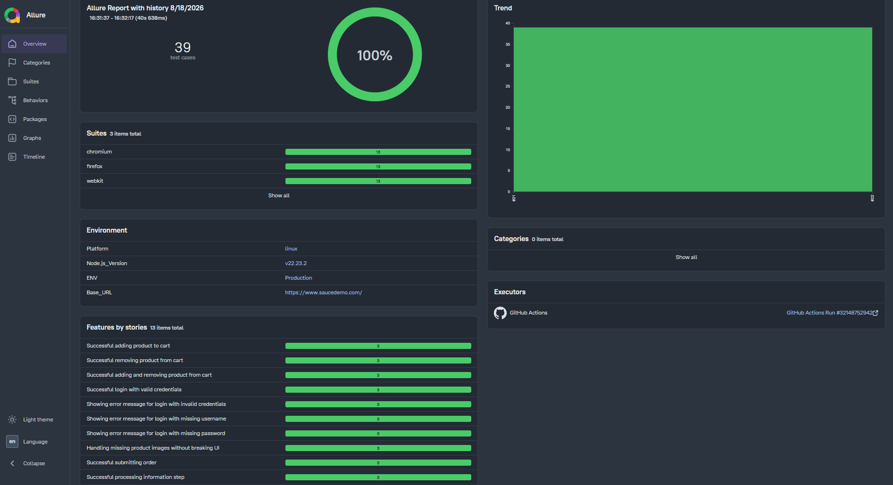

# 🎭 Playwright UI Testing Portfolio Project

[](https://github.com/michalwarunek/playwright-portfolio/actions)
[](https://michalwarunek.github.io/playwright-portfolio/)

A comprehensive UI test automation framework for the [Sauce Demo](https://www.saucedemo.com/) application, built with **TypeScript** and **Playwright**. This project features a fully automated CI/CD pipeline and dynamic **Allure Reports** deployed directly to GitHub Pages.

---

## 📊 Live Allure Report

View the latest interactive test execution report with build history:  
**[](https://michalwarunek.github.io/playwright-portfolio/)**
*(Click the image above to open the full interactive report)*

---

## 🛠️ Tech Stack

* **Language:** TypeScript
* **Test Framework:** Playwright (UI Testing)
* **Reporting:** Allure Playwright
* **CI/CD:** GitHub Actions
* **Report Hosting:** GitHub Pages
* **Containerization:** Docker
* **Target Application:** SauceDemo (React.js Web App)

---

## 🎯 Test Scope & Capabilities

### 🖥️ UI & Functional Testing
End-to-end user journey coverage for the SauceDemo store:
* **Positive & Negative Scenarios:** Validation of authentication flows and full checkout pipelines.
* **Error Handling:** Verification of invalid credentials, and missing mandatory form fields.
* **Network Mocking & Interception:** Simulating network failures and broken assets (e.g., aborting image requests to verify fallback UI behavior).

### 👁️ Visual Regression Testing
Pixel-perfect screenshot comparison across pages and dynamic components:
* **Cross-Platform Consistency:** Standardized Docker container execution ensuring visual snapshots match seamlessly between local development (Windows) and CI/CD runners (Linux).
* **Threshold & Layout Validation:** Automated diffing to catch unintended CSS shifts, font rendering anomalies, and missing elements.

### ⚙️ CI/CD & Pipeline Optimization
* **Dockerized Execution:** Headless test execution inside isolated Linux containers to prevent environment-specific rendering discrepancies.
* **Browser Caching:** Cached Playwright browser binaries in GitHub Actions workflows to drastically cut build and execution times on every push.

---

## 🚀 Getting Started

### Prerequisites

* Node.js (v18+)
* Git
* Docker (for visual regression tests)

### Installation

1. **Clone the repository:**
   ```bash
   git clone https://github.com/michalwarunek/playwright-portfolio.git
   cd playwright-portfolio
   ```
2. **Install dependencies:**

   ```bash
   npm install
   npx playwright install --with-deps
   ```

## 🧪 Running Tests
**Run all UI tests**
```bash
npx playwright test
```
**Run visual regression tests in Docker**
```bash
npm run test:docker
```
**Update visual baseline snapshots via Docker**
```bash
npm run test:docker:u
```
**Generate and serve the Allure Report locally**
```bash
npx allure serve allure-results
```
## 🔄 CI/CD Pipeline & GitHub Actions
The GitHub Actions workflow triggers automatically on every push or pull_request to the main branch:
+ Restores cached Playwright browser binaries to accelerate pipeline runs.
+ Executes the end-to-end and visual regression test suites.
+ Dynamically injects environment metadata (environment.properties).
+ Generates the Allure Report and deploys it to GitHub Pages with historical trend retention.


## 📁 Project Structure
```files
├── .github/                # GitHub Actions workflows and CI/CD configs
├── docs/                   # Additional project documentation
├── fixtures/               # Playwright test fixtures and custom setups
├── pages/                  # Page Object Model (POM) classes and UI locators
├── test-data/              # Static or dynamic test data (payloads, JSONs)
├── tests/                  # E2E test suites
├── .gitignore              # Git ignored files and directories
├── package.json            # Project dependencies, metadata, and scripts
├── playwright.config.ts    # Main Playwright configuration
└── Readme.md               # Project documentation
```